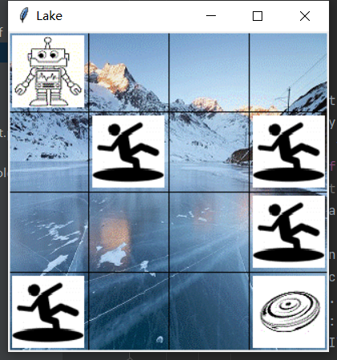

# ME5406_project1

## Introduction
This is a coursework project of ME5406 (Deep Learning in Robotics) in NUS.<br>
The project aims to solve the `Frozen Lake Problem` which contains two tasks via model-free reinforcement learning approaches. 
The Frozen Lake problem considers a frozen lake as a grid-world scenario that a robot is to glide on the frozen surface from the top left corner to the bottom right corner in order to pick up a frisbee while avoiding falling into holes covered by patches of very thin ice.<br>

<br>

* ### Algorithms
1. First-visit Monte Carlo control without exploring starts.
2. SARSA with an ϵ-greedy behavior policy.
3. Q-learning with an ϵ-greedy behavior policy
<br>

## Install
The below shows some of the packages required in this project.
```shell
pip install numpy==1.21.2
pip install pandas==1.3.2
pip install seaborn==0.11.2
pip install matplotlib==3.4.3
```
<br>

## Usage
* This project is implemented under `Python 3.8`, and the environment is set up by using `tkinter`. If you don't have tkinter package, pip install it at first.<br>
* The structure of the contents of the folder `task1` and `task2` is similar.<br>
```shell
lake_env.py         # Environment setup file, including state and action spaces and reward function, etc.
RL_teq.py           # Algorithm file, which contains the policy function, update function, plot function, etc.
Q_learning_run.py   # Main file to run the training of Q-learning algorithm
SARSA_run.py        # Main file to run the training of SARSA algorithm
MC_run.py           # Main file to run the training of Monte Carlo algorithm
comparison.py       # File to compare the performance of three algorithms
```
